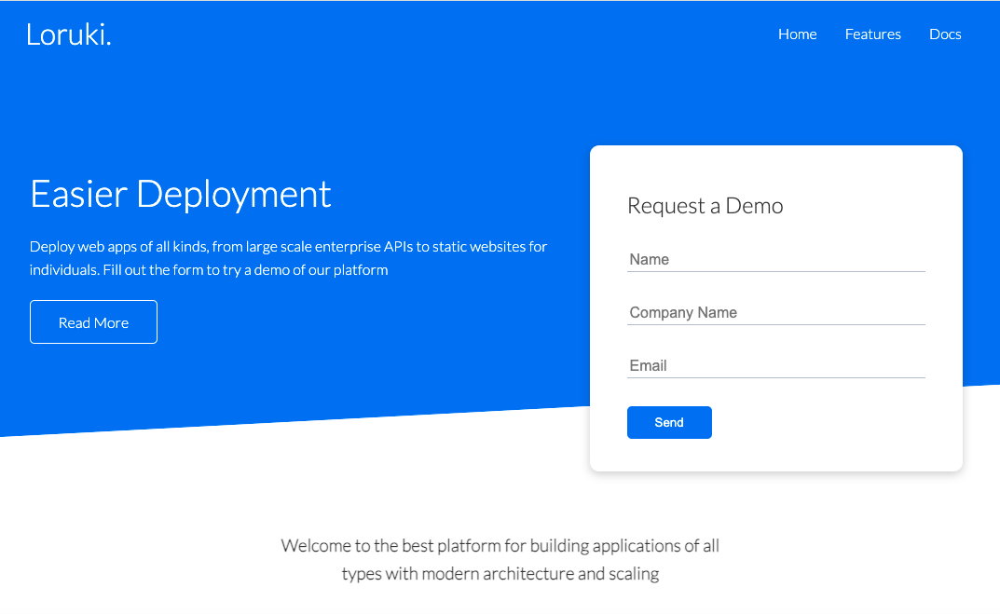

# Loruki website reconstruction 🚧

> A website for developers and students.

## ✅ Table of contents

- [Loruki website reconstruction 🚧](#loruki-website-reconstruction-)
  - [✅ Table of contents](#-table-of-contents)
  - [✅ General info](#-general-info)
  - [✅ Screenshots](#-screenshots)
  - [✅ Technologies](#-technologies)
  - [✅ Code Examples](#-code-examples)
  - [✅ Features](#-features)
  - [✅ Status](#-status)
  - [✅ Collaborators](#-collaborators)
  - [✅ Coaches](#-coaches)

## ✅ General info

This project's main goal is planning and collaborating as a team for the
reconstruction of the Loruki website. We are aiming to learn how to create
responsive websites as well as CSS Grid and Flexbox.

## ✅ Screenshots



## ✅ Technologies

- HTML 5
- CSS 3
- VS Code

## ✅ Code Examples

```<!DOCTYPE html>
<html lang="en">
  <head>
    <meta charset="UTF-8" />
    <link rel="icon" type="image/svg+xml" href="./client/assets/favicon.ico" />
    <meta name="viewport" content="width=device-width, initial-scale=1.0" />
    <title>project!</title>

    <link href="./styles/index.css" rel="stylesheet" />
  </head>
  <body></body>
</html>

```

## ✅ Features

- Responsive Website
- CSS Grid
- Flexbox

## ✅ Status

Project is: _in progress_

## ✅ Collaborators

- [Cristobal-Lopez](https://github.com/cristobal-lopez)
- [Haneefa-Shaik](https://github.com/Haneefa-Shaik)
- [yeasung240](https://github.com/yeasung240)
- [kiishiakande](https://github.com/kiishiakande)

## ✅ Coaches

- [Samir M.](https://github.com/samirm00)
- [Tamer A.](https://github.com/talmurshidi)
